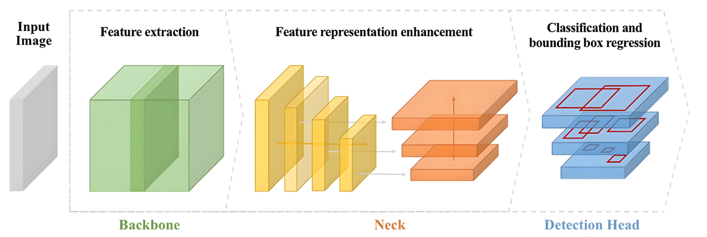
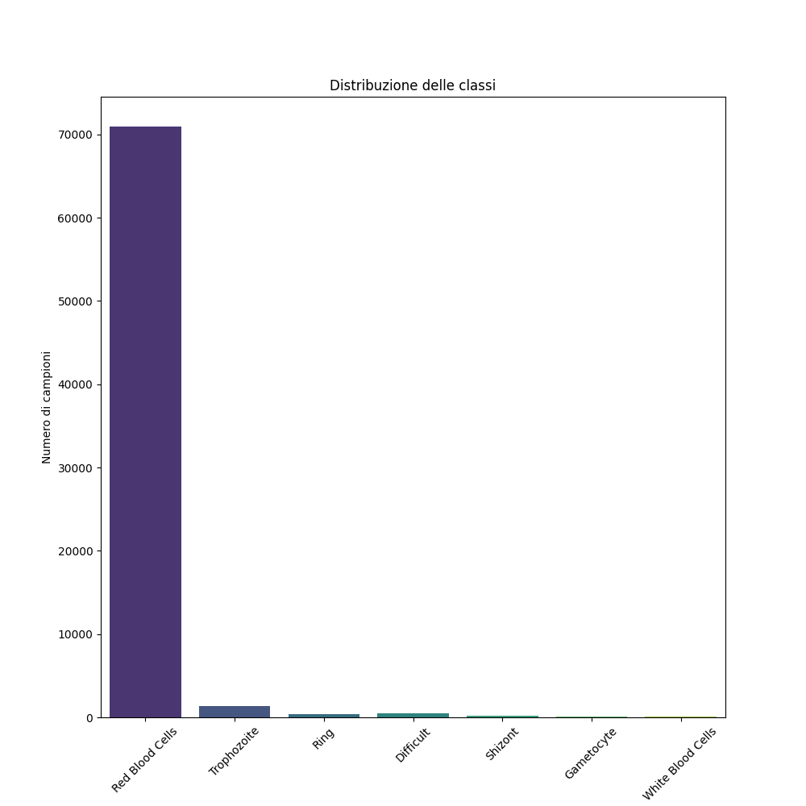

# Blood Cells Detection and Classification
## Using Deep Learning and Machine Learning

Progetto di tesi magistrale presso l'Università degli Studi di Cassino e del Lazio Meridionale, focalizzato sull'identificazione automatica delle cellule del sangue infette da **Plasmodium vivax** tramite tecniche avanzate di **Deep Learning** e **Machine Learning**.

  

---

## Obiettivo

Realizzare un sistema automatico in grado di:
- Rilevare le **regioni di interesse (ROI)** contenenti cellule ematiche.
- Estrarre le **feature visive** da tali regioni.
- Classificare le cellule in:
  - Cellule sane: `Red blood cell`, `Leukocyte`
  - Cellule infette: `Trophozoite`, `Ring`, `Gametocyte`, `Schizont`, `Difficult`

  

---

## Dataset

- Dataset: [P. vivax malaria infected human blood smears](https://www.kaggle.com/datasets)
- Dimensioni: 1.328 immagini (1600x1200), 86.035 oggetti annotati
- Classi:
  - `Red blood cell` (96.5%)
  - `Trophozoite`, `Ring`, `Schizont`, `Gametocyte`, `Leukocyte`, `Difficult`

⚠️ **Estremo sbilanciamento** tra classi gestito tramite tecniche di bilanciamento, data augmentation e Focal Loss.

  

---

## Strumenti Utilizzati

- **Deep Learning**: PyTorch, Albumentations, YOLOv8, Faster R-CNN, RetinaNet
- **Machine Learning**: Scikit-learn, XGBoost
- **Data Analysis**: NumPy, Pandas, Matplotlib
- **Preprocessing**: BorderlineSMOTE, Variance Threshold, SelectKBest, LDA

---

## Architettura del Sistema

### Fase 1: Deep Learning
- Rilevamento automatico delle ROI con modelli di object detection.
- Miglior modello: `Faster R-CNN + ResNeXt101`
- Tecniche:
  - Personalizzazione delle Anchor Boxes (K-Means)
  - Data Augmentation (Albumentations)
  - Focal Loss per gestire lo sbilanciamento
- Metriche:
  - `mAP@50 = 0.9479`, `F1 Score = 0.9708`

### Fase 2: Machine Learning
- Classificazione delle feature estratte (da ROI rilevate)
- Approccio a **2 stadi**:
  1. Classificazione binaria (Cellule sane vs infette)
  2. Classificazione delle cellule infette in 5 sottoclassi
- Tecniche usate: LDA, SMOTE, SVM, Random Forest
- Miglior classificatore: **SVM polinomiale**

---

## Risultati

| Stage | Tipo | F1 Score |
|------:|------|----------|
| 1     | Sano vs Infetto | 0.75 |
| 2     | Classi Infette  | 0.32 |

> Performance migliori nella prima fase, con difficoltà crescenti nella classificazione fine delle classi infette.

  

---

## Autori

- **Achille Cannavale**  
  Email: [achille.cannavale@libero.it](mailto:achille.cannavale@libero.it)  
  GitHub: [@Achille1912](https://github.com/Achille1912)

- **Noemi La Torre**  
  Email: [latorre.noemi17@gmail.com](mailto:latorre.noemi17@gmail.com)  
  GitHub: [@noemilatorre](https://github.com/noemilatorre)
